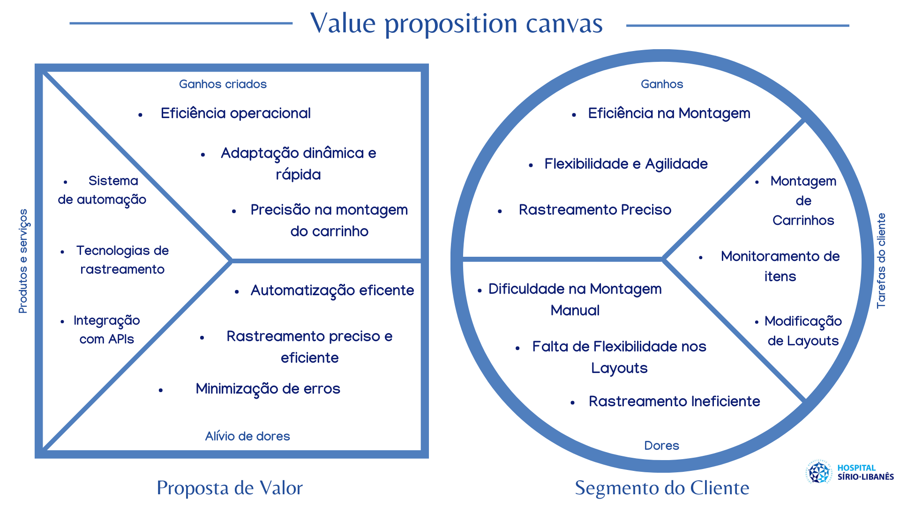

import useBaseUrl from "@docusaurus/useBaseUrl";

# Matriz de avaliação de valor Oceano Azul

&emsp;O conceito de Oceano Azul, desenvolvido por Renée Mauborgne e W. Chan Kim, é uma abordagem inovadora nos negócios, conforme detalhado em seu livro de título correspondente. Ao invés de buscar constantemente superar a concorrência, a proposta central é explorar mercados inexplorados como estratégia primordial.

&emsp;Para implementar essa abordagem, é crucial utilizar ferramentas que possibilitem o monitoramento e a tomada de decisões voltadas para a Inovação de Valor. Entre essas ferramentas, destaca-se a Matriz de Avaliação de Valor, a qual permite que as empresas realizem uma análise detalhada de como cada segmento de seu negócio proporciona valor aos clientes. Essa matriz abrange avaliações criteriosas de fatores como preço, qualidade, segurança e outras características relevantes. Além disso, deve-se diferenciar cada atributo da concorrência por meio das ações Reduzir, Eliminar, Aumentar e Criar.

<b> Tabela 1 - Tabela Matriz de avaliação de valor Oceano Azul </b> 

| **Atributos** | **ARM** | **Método tradicional** |
| :-----------: | :-----: |:---------------------: |
| Preço | 5 | 10 |
| Precisão | 9 | 7 |
| Tecnologia | 10 | 5 |
| Segurança | 8 | 5 |
| Praticidade | 9 | 0 |
| Previsibilidade | 9 | 7 |
| Tempo de montagem | 5 | 5 |
| Intervenção humana | 4 | 10 |
| Montagem Manual | 0 | 10 |

<b> Figura Gráfico 1 - Matriz de avaliação de valor Oceano Azul </b> 

  </img>
  
<b>Fonte:</b> elaborado por Arm 

## Reduzir

&emsp;**Preço:** Cada robô custa cerca de 32.000 reais. Considerando que este é um gasto único, a longo prazo, essa é uma solução mais econômica. Atualmente, cada auxiliar de farmácia custa 2.500 reais, sendo necessários 10 auxiliares para realizar esse trabalho mensalmente. Assim, o gasto do hospital em um único mês é de 25.000 reais apenas com as montagens dos kits de emergência.

&emsp;**Tempo de Montagem:** O tempo de montagem utilizando o robô é mais rápido do que o método tradicional, mas o maior ganho é economizar o tempo dos auxiliares nessa tarefa ao utilizar o robô.

&emsp;**Intervenção Humana:** O MVP permite que a montagem dos kits seja totalmente automatizada. É necessário apenas que um auxiliar de farmácia configure a disposição dos medicamentos no kit e prepare o material.

## Eliminar

&emsp;**Montagem Manual:** O MVP permite que a montagem dos kits seja totalmente automatizada, sem a necessidade de interferência externa.

## Aumentar

&emsp;**Precisão:** A cliente mencionou que é comum ocorrerem erros nas montagens dos kits devido ao desvio de atenção dos auxiliares de farmácia responsáveis pela verificação de qualidade e montagem. Esse tipo de erro seria consideravelmente reduzido, pois o braço robótico segue sempre o mesmo padrão, tornando os erros na montagem casos isolados.

&emsp;**Segurança:** No método tradicional, o contato humano está presente em todas as fases do processo de montagem dos kits, aumentando os riscos de contágio por bactérias. A utilização do robô aumentará a segurança hospitalar, garantindo que o contato humano esteja presente apenas nos momentos essenciais.

&emsp;**Previsibilidade:** O robô não requer manutenção frequente, embora seja essencial para manter o bom funcionamento e a durabilidade do equipamento. Por outro lado, o trabalho manual possui o risco de o trabalhador faltar ao serviço por diversos motivos ou até mesmo ser demitido, gerando a necessidade de grandes mudanças e preocupações.

## Criar

&emsp;**Praticidade:** O processo atual é pouco prático e consome muito tempo dos auxiliares, que poderiam estar realizando outras tarefas. O MVP torna o processo mais prático para os auxiliares, sendo a presença deles necessária apenas para iniciar e finalizar o processo.

&emsp;Analisando a matriz, observa-se o potencial do projeto para transformar significativamente o processo na farmácia hospitalar, beneficiando diversos pacientes e direcionando o tempo de trabalho dos auxiliares de farmácia para tarefas onde a presença humana é realmente essencial.

---

## Análise Financeira

&emsp;A análise financeira é fundamental para avaliar a viabilidade de investimento em um projeto considerando os custos, o consumo de tempo e a mudança na qualidade enquanto compara com outras alternativas disponíveis. Nesse estudo, foi feita uma análise comparando o braço mecânico MG400 com o método tradicional e manual de montagem dos kits.

### Análise do custo do método Arm

<b> Tabela 2 - Análise do custo anual do método Arm </b> 

| **Componente** | **Custo em 5 meses** | **Custo do mês 6 ao 12** |
| :-------------: | :--------: | :----: |
| Braço mecânico - MG400 | R$ 32000,00 | 0 |
| Desenvolvedor Front-end | R$ 23520,00 | 0 | 
| Desenvolvedor Back-end | R$ 39035,00 | 0 |
| Engenheiro da Computação | R$ 40260,00 | 0 | 
| Programador de Automação Industrial | R$ 29000,00 | 0 | 
| Product Owner (PO) | R$ 69090,00 | 0 | 
| Manutenção | R$ 8000,00 | R$ 11200,00 | 
| Raspeberry Pi Pico W | R$ 49,90 | 0 |
| Instalação do MG400 | R$ 1000,00 | 0 | 
| Auxiliar De Farmácia Hospitalar | R$ 9660,00 | R$ 13524,00 | 
| TOTAL | R$ 262814,90 | R$ 24724,00 | 

&emsp;Atualmente, o parceiro Hospital Sírio-Libanês enfrenta problemas de demora na montagem de kits de emergência, além de frequentes erros durante esse processo. Essas questões são decorrentes de um método manual, suscetível a falhas humanas.

&emsp;Foi identificado que o responsável pela montagem dos kits de emergência é o Auxiliar de Farmácia hospitalar, que desempenha outras atividades além dessa e custa ao hospital, em média, dois mil reais por mês. Com a automação utilizando um braço robótico, o auxiliar ainda será necessário, mas apenas para configurar a montagem do kit. Dessa forma, o auxiliar terá mais tempo para realizar outras tarefas que dependem de suas habilidades e experiência, direcionando suas atividades no hospital para aquelas em que a presença humana seja realmente essencial.

&emsp;Para uma melhor estimativa dos custos do projeto, a análise financeira foi realizada para os primeiros 5 meses, considerando os gastos fixos, como o braço mecânico, o Raspberry Pi Pico W e o custo de instalação, somados aos custos mensais (multiplicados pelos meses em que esse gasto é necessário). Dado esse contexto do cálculo, os primeiros 5 meses de utilização da solução seria de R$ 262814,90. Nos 7 meses posteriores, é estimado que gastos como desenvolvedores do projeto, braço mecânico e outros custos iniciais não se repitam, por isso o cálculo leva em consideração apenas manutenção e o salário do auxiliar de farmácia, chegando a um custo de R$24724,00. É importante ressaltar que os valores nessa análise correspondem aos valores de abril de 2024 e devem ser ajustados conforme a inflação nos anos posteriores de existência do projeto para maior precisão na previsão dos gastos com o mesmo.

&emsp;Com o custo inicial de R$ 262814,90 e o custo de R$ 24724,00 nos últimos 7 meses do primeiro ano de operação do projeto, compreendemos que essa não é uma solução economicamente vantajosa. No entanto, a utilização de um braço mecânico na montagem dos kits trará mais segurança hospitalar, reduzindo as chances de contaminação, e maior precisão durante o processo, resultando em escolhas de medicamentos mais acertadas pelos médicos em situações de emergência.

&emsp;É importante notar que os ganhos do projeto impactam diretamente que os benefícios do projeto repercutem diretamente em um atendimento mais eficiente aos pacientes, proporcionando maior satisfação. Esses ganhos também têm impacto nos processos legais que o hospital poderia enfrentar devido a erros médicos, conferindo uma maior segurança para evitar gastos imprevistos nesse sentido.

---

# Value Proposition Canvas

&emsp;O Value Proposition Canvas é uma ferramenta utilizada para garantir que haja compatibilidade entre o produto desenvolvido e o mercado. Ele consiste em dois componentes principais: o perfil do cliente, que descreve os segmentos de clientes, suas necessidades e tarefas, e a proposta de valor, que detalha os benefícios oferecidos e como atendem às necessidades dos clientes. Essa abordagem técnica corrobora para a criação de produtos e serviços mais alinhados com as expectativas do mercado-alvo. 

<b>Quadro 1 - DValue Proposition Canvas do Hospital Sírio Libanês</b> 

 

<b>Fonte: Elaborado pelos próprios autores </b> 

&emsp;O componente da proposta de valor consiste em "Ganhos criados", "Produtos e serviços" e "Dores aliviadas". Os ganhos criados para o Sírio-Libanês com a automação incluem uma adaptação dinâmica e rápida, aumento da eficiência operacional e precisão na montagem do carrinho de medicamentos. Os produtos e serviços compreendem um sistema integrado com um braço robótico e uma interface que garante uma maior segurança na montagem. Isso contribui para a eficiência da logística e permite um controle preciso sobre os insumos em movimento, proporcionando acesso às mais recentes tecnologias, enquanto alivia as dores com a minimização de erros, rastreamento preciso e eficaz e automatização eficiente.

&emsp;O segmento do cliente compreende "Ganhos", "Tarefas do Cliente" e "Dores". Os "Ganhos" envolvem benefícios como eficiência na montagem, flexibilidade e agilidade, otimização da logística e rastreamento preciso dos insumos. A "Tarefa do Cliente" consiste em ser adaptável nas mudanças de layouts, fazer o monitoramento de itens e a montagem dos carrinhos. As "Dores" são representadas pela falta de rastreamento interno para os insumos, a ausência de flexibilidade e o tempo gasto na montagem manual dos kits e carrinhos de emergência.

---

# Matriz de Risco

&emsp;A matriz de riscos é uma ferramenta de análise de negócios que envolve a criação de uma tabela na qual os riscos são listados nas linhas e os impactos e probabilidades são listados nas colunas. As células da matriz são preenchidas com informações que descrevem a gravidade do risco (impacto) e a probabilidade de ocorrência. Isso permite que a organização avalie quais riscos são os mais críticos e onde é necessário dedicar recursos para gerenciá-los.

&emsp;A matriz de risco desempenha um papel fundamental ao avaliar e gerenciar riscos em projetos ou implementações. Desse modo, uma matriz bem elaborada possibilita à equipe priorizar os riscos mais críticos, tornando mais fácil a implementação de medidas preventivas e corretivas apropriadas. Desta maneira, os impactos negativos possíveis são reduzidos. Considerando as particularidades da equipe e do projeto em questão, apresento a seguir uma análise de riscos específica para este empreendimento.

&emsp;No caso do projeto, essa matriz guia organicamente o grupo ARM para voltar a atenção em relação a possibilidades de riscos e oportunidades.

<b>Quadro 2 - Matriz de Risco</b> 

 

<b>Fonte: Elaborado pelos próprios autores </b> 

&emsp;Com o intuito de melhorar a clareza da imagem, procedemos à transcrição dos textos nela contidos e os estruturamos em tópicos separados, da seguinte maneira:

## Riscos potenciais

- Deixar de atender todas as dores que o cliente trouxe até nós, como a automação na montagem dos kits (Probabilidade: Muito Baixa 10% X Impacto: Muito Alto)
- A solução IOT não atender e agregar valor ao cliente (Probabilidade: Moderada 50% X Impacto: Muito alto);
- Complexidade do projeto ser muito alta, consequentemente fugindo da capacidade de realizar (Probabilidade: Moderada 70% X Impacto: Muito alto);

## Riscos reais

- O tempo de 10 semanas  ser curto para realizar o MVP devido a complexidade (Probabilidade: Alta 70% X Impacto: Muito baixo);
- Não conseguirmos integrar o robô com a aplicação WEB (Probabilidade: Média 50% X Impacto: Alto);
- Falta de conhecimento técnico para realizar a automação do braço robótico (Probabilidade: Baixa 10% X Impacto: Muito baixo);
- Falta de planejamento ao dividir as tarefas para a execução do projeto (Probabilidade: Muita Baixa 10% X Impacto: Baixo);
- Fluxo da interface produzida pela equipe ser confusa para o usuário (Probabilidade: Muita Baixa 10% X Impacto: Moderado);
- Falhas de comunicação durante as dailys do grupo podem impactar no andamento do MPV (Probabilidade: Muita Baixa 30% X Impacto: Moderado);
- O projeto não diminuir o tempo de montagem de um carrinho de parada no hospital (Probabilidade: Muito Baixa 30% X Impacto: Alto)
- O cliente não conseguir implementar sozinho a nossa solução lendo a documentação (Probabilidade: Média 50% X Impacto: Moderado)

## Plano de ação e resposta para todos os riscos

### Potenciais

- Criar um cronograma realista e atribuir tarefas específicas para a equipe e mantê-la bem atualizada sobre o escopo do projeto e as expectativas do cliente, incentivando a busca por melhorias e aperfeiçoamento contínuo, para que os objetivos sejam alcançados dentro do prazo estabelecido.

- Validar a cada sprint a construção da solução IOT, sempre buscando o aperfeiçoamento de acordo com os feedbacks do cliente, para que assim não haja conflito durante a entrega final do MVP.

- Sempre que necessário pedir auxílio aos instrutores para conseguir entender e superar os desafios que iremos enfrentar durante o módulo, dessa forma, alcançaremos a conclusão do MVP.

### Reais:

- Ao não seguir um bom planejamento e se atentar a organização do projeto pode vir a ocorrer a falta de tempo, entretanto, para que isso não seja um problema e não venha a ocorrer, a equipe optou por trabalhar com a metodologia Agile e Kanban, o que permitirá a divisão eficiente das tarefas e sua conclusão dentro do prazo estabelecido.

- Ao utilizar diferentes tecnologias para produzir o algoritmo do robô e de nossa aplicação WEB, pode haver conflitos em sua integração. Isso representa um risco muito alto, pois não será possível operar a solução. portanto, é necessário desde o início do projeto pesquisar e se aprofundar nos conceitos que iremos utilizar, para que assim, seja possível no fim do projeto integrar uma parte a outra, sem que haja imprevistos ao chegar nessa etapa.

- Implementar treinamentos técnicos específicos para a equipe visando prevenir lacunas de conhecimento e assegurar a execução eficiente do projeto. Além disso, manter canais abertos de comunicação para identificar e abordar rapidamente qualquer falta de compreensão técnica que possa surgir.

- No início do projeto, é fundamental criar um planejamento básico que aborda apenas o escopo, a fim de evitar frustrar o cliente com quebras de expectativas.

- Além disso, é essencial garantir que a solução IOT seja eficaz e de fácil manuseio para que a pessoa utilize o sistema sem problemas, garantindo assim, a sua eficácia em reduzir o tempo de montagem dos kits que irão ser montados.

- Promover uma cultura de comunicação aberta e honesta, incentivando os membros da equipe a relatarem problemas ou preocupações.

- Marcar encontros de validação com o cliente para que possamos entender da melhor forma possível o que ele realmente precisa e assim entregar a melhor personalização da solução para tal. 

- Trabalhar em uma documentação clara e concisa desde o início do projeto é fundamental para que o cliente possa dar continuidade em nosso MVP e implementar em larga escala. Portanto, sempre que for preciso iremos formatar a documentação para que ela fique com o entendimento o mais claro possível, passando por revisões e reestruturações periodicamente.

## Oportunidades potenciais:

- Desenvolvimento de Parcerias Estratégicas com empresas de automação (Probabilidade: Baixa 30% x Impacto: Alto)
- Feedback Positivo do Cliente (Probabilidade: Alta 70% x Impacto: Muito Alto)

## Oportunidades reais:

- Aprendizado Técnico da Equipe durante o desenvolvimento (Probabilidade: Alta 90% x Impacto: Alto)
- Inovação na Automação de Montagem de Kits (Probabilidade: Média 50% x Impacto: Muito Alto)
- Colaboração Eficiente com o Cliente para melhoras no projeto (Probabilidade: Alta 90% x Impacto: Muito Alto)
- Desenvolvimento de Habilidades Ágeis (Probabilidade: Muito Alta 90% x Impacto: Alto)
- Documentação Eficaz como Diferencial Competitivo (Probabilidade: Alta 90% x Impacto: Moderado)

## Plano de ação e resposta para todas as oportunidades:

## Potenciais:

- Identificar empresas estratégicas no setor de automação, analisar e iniciar negociações para estabelecer parcerias duradouras. Isso inclui realizar pesquisa de mercado, agendar reuniões exploratórias e desenvolver propostas de parceria personalizadas.

- Aproveitar os encontros com o parceiro para implementar uma abordagem ágil para coleta contínua de feedback e personalizar a solução conforme preferências do cliente e garantir canais eficazes de comunicação. Isso envolve incorporar os feedback em cada parte do projeto, realizar reuniões regulares e ajustar a solução conforme o feedback recebido.

## Reais:

- Encorajar a equipe a ver desafios técnicos como oportunidades de aprendizado e fomentar no grupo uma cultura de aprendizado contínuo. Isso inclui identificar tópicos mais desafiadores a cada sprint e estabelecer um ambiente seguro para a troca de conhecimento.

- Gastar mais tempo em pesquisas em tecnologias inovadoras, realizar análises de benchmarking, sempre buscando ao máximo experimentar protótipos inovadores.

- Estabelecer canais de comunicação abertos, utilizar dos encontros de validação para implementar uma abordagem colaborativa na adaptação da solução.

- Utilizar a metodologia SCRUM no processo de desenvolvimento, promover a divisão eficiente de tarefas, a realização das dailies e incentivar a colaboração em equipe.

- Estabelecer uma abordagem para a criação e manutenção de documentação clara e concisa, realizar revisões periódicas e posicionar a documentação como recurso valioso para o cliente. 

&emsp;Portanto, a análise detalhada da matriz de risco oferece uma perspectiva valiosa para a gestão eficaz do projeto em parceria com o Hospital Sírio-Libanês. Ao destacar riscos potenciais e oportunidades estratégicas, estamos melhor posicionados para adotar medidas preventivas, superar desafios e otimizar os benefícios ao longo do desenvolvimento do projeto. Essa abordagem proativa não apenas fortalece a resiliência operacional, mas também promove uma colaboração sólida, visando o sucesso duradouro da iniciativa e a criação de valor sustentável para todas as partes envolvidas.

---

## Bibliografia:

SOLAR, N. Preço da energia elétrica CPFL 2023. Disponível em: https://www.ngsolar.com.br/single-post/preco-kwh-cpfl#:~:text=Com%20o%20reajuste%20de%202023.

LTDA, I. B. A. DE I. Salário de Auxiliar De Farmácia Hospitalar | Infojobs. Disponível em: https://www.infojobs.com.br/salario/auxiliar-farmacia-hospitalar. Acesso em: 16 fev. 2024.
