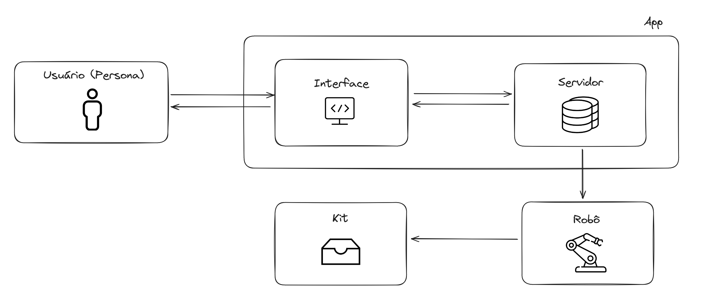

# Requisitos funcionais e requisitos não funcionais

&emsp;Os requisitos são elementos indispensáveis para que uma solução possa se tornar operacional, proporcionando segurança e eficiência na resolução de um problema previamente proposto. Nesse contexto, a ausência de requisitos como conectividade, sistema operacional, plataforma e interface, por exemplo, inviabiliza o desenvolvimento de um software operacional para a utilização por parte do usuário. Assim, tanto os requisitos funcionais quanto os não funcionais desempenham um papel de extrema importância na concepção e na usabilidade de um sistema a ser desenvolvido. Esses elementos são cruciais para assegurar que a solução atenda às expectativas, seja segura e ofereça uma experiência eficaz aos usuários. [1]

&emsp;Nessa perspectiva, os requisitos funcionais, também conhecidos como RF, constituem uma categoria de especificações que delineiam as capacidades específicas que nosso sistema deve possuir para atender aos objetivos do negócio ou às necessidades do usuário. Concentramo-nos nas funcionalidades específicas que o sistema deve executar e detalhamos as interações entre o usuário e o sistema, definindo as ações que o sistema deve realizar, desde a entrada inicial até as saídas esperadas, incluindo a manipulação de dados durante o processo. [2]

&emsp;Além disso, os requisitos não funcionais, também conhecidos como RFN, são aquelas características ou qualidades que nosso sistema deve apresentar para satisfazer as expectativas dos usuários ou dos stakeholders. Delineamos os atributos que o sistema deve possuir, abrangendo aspectos como Adequação Funcional, Eficiência de performance, Compatibilidade, Usabilidade, Confiabilidade, Segurança, Manutenibilidade e Portabilidade, conforme definidos pela ISO 25010. [3]

&emsp;A descrição para cada atributo dos requisitos não funcionais é a seguinte:

- Adequação Funcional: característica que diz respeito à capacidade do nosso software em cumprir efetivamente sua finalidade proposta. [3]
- Eficiência de performance: características que dizem ao sistema os níveis de desempenho que devem ser utilizados de acordo com a quantidade de recursos utilizados. [3]
- Compatibilidade: característica da capacidade do sistema para intercambiar informações e executar funções ao compartilhar um ambiente ou recursos com outros sistemas, produtos ou componentes. [3]
- Usabilidade: característica que descreve como nosso sistema deve se portar para o usuário para o seu entendimento, funcionamento e utilização para determinada tarefa. [3]
- Confiabilidade: característica da capacidade do sistema em executar determinadas ações em condições específicas. [3]
- Segurança: capacidade do nosso produto ou sistema proteger informações e dados de vulnerabilidades que podem comprometer o sistema executado. [3]
- Manutenibilidade: característica que abrange a capacidade do nosso produto ou sistema ser alterado, atualizado e adaptado às mudanças no ambiente e aos requisitos. [3]
- Portabilidade: características para possibilitar a transferência de um ambiente para outro. [3]

&emsp;Em suma, com as perspectivas apresentadas e com base no TAPI, nossos requisitos funcionais podem ser visualizados no Quadro 1 - Requisitos funcionais do sistema, e os requisitos não funcionais podem ser vistos no Quadro 2 - Requisitos não funcionais do sistema.

<b> Quadro 1 - Requisitos funcionais do sistema </b> 

| Requisito Funcional | Descrição                                                                                                   |
|:---------------------:|:-----------------------------------------------------------------------------------------------------------:|
| RF01                 | O braço robótico deve pegar itens especificados pelo usuário e colocar nas posições especificadas do kit.    |
| RF02                 | O braço robótico deve pegar objetos de diferentes diâmetros e formatos para serem colocados no kit.         |
| RF03                 | O sistema deve registrar quais os medicamentos que foram dispostos no kit.                                   |
| RF04                 | A interface deve ser programável para a montagem de diferentes kits.                                      |
| RF05                 | A interface deve armazenar estados específicos da localização de cada item no kit.                        |
| RF06                 | O braço robótico deve pegar os itens sem danificar os medicamentos.                                           |
| RF07                 | O braço robótico deve identificar se está carregando algum objeto.                                             |

<b>Fonte: Elaborado pelos próprios autores </b> 

**RF01:** O braço robótico deve pegar itens especificados, que neste caso são os medicamentos, conforme indicado pelo usuário, e colocá-los nas posições designadas do kit em setores específicos, como cirúrgico, de endoscopia, etc.

**RF02**: O braço robótico deve pegar objetos de diferentes diâmetros e formatos para serem colocados no kit. Isso permite a montagem de kits variados sem a necessidade de trocar a garra que manipula esses medicamentos.

**RF03**: O sistema deve registrar quais medicamentos foram alocados no kit. Isso abrange todos os medicamentos retirados do "estoque de reposição" para serem colocados no novo kit, sendo registrado no banco de dados para identificar a destinação de cada produto.

**RF04**: A interface deve ser programável para a montagem de diferentes kits, pois a página precisa suportar layouts distintos para garantir a montagem precisa de cada kit pré-definido.

**RF05**: Refere-se à representação gráfica da localização em que cada kit foi armazenado, indicando todos os medicamentos presentes.

**RF06**: Refere-se à responsabilidade do robô em garantir que nenhum medicamento seja danificado durante o processo de pegar e colocar no kit, evitando, por exemplo, o uso excessivo de força.

**RF07**: O braço robótico deve assegurar que tenha pegado algum item para ser colocado no kit e verificar se o objeto foi adequadamente capturado.

<b> Quadro 2 - Requisitos não funcionais do sistema </b> 

| Requisito Não Funcional | Descrição                                                             | Atributo de Qualidade da ISO 25010 |
|-------------------------|-----------------------------------------------------------------------|-------------------------------------|
| RNF01                   | O sistema deve possuir uma interface para que o usuário possa mudar o padrão de movimento do braço robótico. | Adequação Funcional                  |
| RNF02                   | O sistema deve ter confiabilidade nos dados que estão sendo coletados dos itens que foram retirados do kit.  | Confiabilidade                      |
| RNF03                   | O sistema de comunicação deve mandar uma mensagem de erro em caso de falha na comunicação em 2 s empíricos. | Eficiência de Performance           |
| RNF04                   | O sistema deve colocar os objetos precisamente nos locais designados do kit. | Eficiência de Performance           |
| RNF05                   | O braço robótico deve ser portátil.                                   | Portabilidade                       |
| RNF06                   | O sistema deve mandar uma mensagem informando caso o braço robótico não tenha pegado algum item. | Usabilidade                         |
| RNF07                   | O sistema deve reportar o estado de a tarefa está sendo executada.    | Usabilidade                         |

<b>Fonte: Elaborado pelos próprios autores </b> 

**RNF01**: O sistema deve possuir uma interface para que o usuário possa mudar o padrão de movimento do braço robótico. Isso é alcançado através da construção de uma interface gráfica que apresentará os principais movimentos do braço. Dessa forma, caso determinada localização não esteja pré-definida no layout, será possível colocá-la manualmente e gravá-la.

**RNF02**: O sistema deve ter confiabilidade nos dados que estão sendo coletados dos itens retirados do kit. Isso assegura a segurança de que os medicamentos estão sendo colocados corretamente em cada local pré-definido no kit, registrando no banco de dados para qual kit foi colocado o item.

**RNF03**: O sistema de comunicação deve enviar uma mensagem de erro em caso de falha na comunicação em 2 segundos empíricos. Isso é importante para alertar o sistema em casos de falhas inesperadas, como perda de conexão ou falta de energia repentina no braço robótico.

**RNF04**: O sistema deve posicionar os objetos precisamente nos locais designados do kit. Isso garante a segurança de que todos os itens estão dispostos corretamente, evitando falta de medicamentos ou posicionamento incorreto no kit.

**RNF05**: O braço robótico deve ser portátil para garantir sua utilização em qualquer local do hospital e ser de fácil manuseio, permitindo que qualquer pessoa possa utilizá-lo.

**RNF06**: O sistema deve enviar uma mensagem informando caso não tenha pegado algum item, garantindo a qualidade do software e o bom funcionamento do braço, evitando falsas colocações em locais pré-definidos e deixando esses locais vazios por não ter colocado o item.

**RNF07**: O sistema deve relatar o estado da execução da tarefa, informando ao usuário quando a montagem do kit começar e quando houver o término dessa tarefa.

---

# Diagrama de blocos da arquitetura do sistema
&emsp;A arquitetura de sistema é uma representação abstrata e conceitual que aborda a estrutura organizacional e o design fundamental de um sistema. Nela, são definidas as interações e relações entre os componentes do sistema para atender aos requisitos funcionais e não funcionais. Essa visão de alto nível orienta o desenvolvimento do sistema, assegurando a coesão entre todos os elementos para alcançar os objetivos do projeto. [4]

&emsp;Dessa maneira, a arquitetura dos sistema baseado no diagrama em blocos para essa solução pode ser vista no Quadro 3.

<b>Quadro 3 - Diagrama de blocos da arquitetura do sistema</b> 

 

<b>Fonte: Elaborado pelos próprios autores </b> 

&emsp;Em resumo, a solução será utilizada pelo usuário (persona) ao acessar o sistema (interface), permitindo que ele configure pré-movimentos do braço mecânico, caso não haja um layout específico de algum kit. Isso atenderá ao requisito RNF01, proporcionando mais liberdade ao usuário. Além disso, se já existir um kit pré-definido, o usuário deverá selecioná-lo no sistema para que o braço robótico execute a tarefa configurada, atendendo assim ao requisito RF01. Por possuir diferentes kits pré-definidos que podem ser selecionados, atende também ao requisito RF04, permitindo a montagem de kits distintos.

&emsp;Na configuração dos medicamentos a serem retirados, a interface enviará para o servidor os itens que foram coletados pelo braço robótico e armazenados nele (banco de dados), contemplando o requisito RF03. Além dessas funcionalidades, o braço robótico deve enviar para o sistema seu estado atual, permitindo que o usuário saiba o que está acontecendo, atendendo ao requisito RNF08.

&emsp;Durante a execução para a montagem do kit, o braço robótico precisa garantir a precisão da disposição dos medicamentos dentro do kit, conforme indicado no requisito RNF04. Contudo, em caso de erro durante a tarefa, o braço robótico deve enviar mensagens de falha para o sistema, conforme sugerido nos requisitos RNF03, e outra mensagem indicando "Falha em pegar um medicamento" se houver erro no momento de coletar o medicamento, conforme sinalizado no requisito RNF06.

---

# Proposta de baixo acoplamento e alta mutabilidade
&emsp;A proposta de baixo acoplamento e alta mutabilidade é uma abordagem que visa aprimorar a arquitetura de software, tornando-a mais flexível e adaptável a mudanças. O baixo acoplamento refere-se à redução da dependência entre os módulos do sistema, permitindo que eles possam ser modificados sem afetar outros componentes. Já a alta mutabilidade refere-se à capacidade do sistema de se adaptar a mudanças, permitindo que novas funcionalidades possam ser adicionadas ou removidas sem impactar o sistema como um todo.

#### Interface do Usuário (UI):
- Desenvolvimento Intuitivo: A interface deve ser intuitiva e amigável, permitindo ao usuário facilmente configurar movimentos pré-definidos do braço robótico (RNF01) e selecionar kits pré-definidos (RF01), além de programar novos layouts de kit (RF04).
- Feedback em Tempo Real: A UI deve fornecer feedback em tempo real sobre o estado do braço robótico (RNF07) e mensagens de erro claras em caso de falha (RNF03, RNF06).
- Personalização e Extensibilidade: A UI deve ser construída de maneira modular para facilitar adições e mudanças, como novos formulários ou funcionalidades.

#### Servidor de Processamento:
- Processamento e Configuração: Deve processar entradas da UI e configurar os movimentos do braço robótico, garantindo a confiabilidade dos dados (RNF02).
- APIs RESTful: Implementar APIs RESTful para comunicação entre o front-end e o back-end, permitindo fácil expansão ou modificação da API conforme necessário.

#### Armazenamento de Dados:
- Banco de Dados Robusto: Deve haver um sistema de armazenamento robusto que possa registrar os itens coletados pelo braço robótico (RF03) e garantir a confiabilidade desses dados (RNF02).
- Design de Banco de Dados Escalável: O design do banco de dados deve ser tal que facilite a manutenção e a escalabilidade, permitindo a inclusão de novos medicamentos ou alterações nos kits sem a necessidade de grandes reformulações.

#### Módulo de Execução de Tarefas:
- Tradução de Comandos: Um módulo dedicado para traduzir configurações de usuário em comandos para o braço robótico deve assegurar a precisão (RNF04, RF06) e identificar se um objeto foi corretamente capturado (RF07).
- Manuseio de Erros: Deve ser capaz de comunicar erros de forma eficiente ao sistema e ao usuário (RNF03, RNF06).

#### Portabilidade e Manutenibilidade:
- Portabilidade do Sistema: Deve-se considerar a portabilidade (RNF05) na escolha da tecnologia, garantindo que o sistema possa ser facilmente adaptado ou transferido para diferentes plataformas ou ambientes operacionais.
- Facilidade de Manutenção: A manutenibilidade (atributo da ISO 25010) deve ser uma prioridade, com código bem documentado, uso de padrões de design e a possibilidade de atualizações e mudanças sem grandes complicações.

#### Considerações Finais:
- Testes e Qualidade: Implementar uma estratégia de testes rigorosa para garantir que todos os requisitos sejam atendidos e que o sistema funcione conforme esperado sob diversas condições.
- Segurança: Integrar medidas de segurança robustas para proteger os dados e operações do sistema (atributo de segurança da ISO 25010).

---

## Bibliografia:
‌[1] CASA DO DEENVOLVEDOR. Requisitos funcionais e não funcionais: o que são e como identificar? Disponível em: [https://blog.casadodesenvolvedor.com.br/requisitos-funcionais-e-nao-funcionais/](https://blog.casadodesenvolvedor.com.br/requisitos-funcionais-e-nao-funcionais). Acesso em: 7 fev. 2024.

[2] Requisitos Funcionais e Requisitos Não Funcionais do Surpreendente ChatGPT. Disponível em: [https://giganteconsultoria.com.br/2023/04/09/requisitos-funcionais-e-requisitos-nao-funcionais-do-surpreendente-chatgpt/](https://giganteconsultoria.com.br/2023/04/09/requisitos-funcionais-e-requisitos-nao-funcionais-do-surpreendente-chatgpt). Acesso em: 7 fev. 2024.

‌[3] SILVA, R. ISO/IEC 25010 e a qualidade de software - Blog One Day Testing. Disponível em: [https://blog.onedaytesting.com.br/iso-iec-25010/](https://blog.onedaytesting.com.br/iso-iec-25010/). Acesso em: 7 fev. 2024.

[4] REDAÇÃO XP EDUCAÇÃO. O que é arquitetura de software? Veja definição e aplicação no mundo corporativo. Disponível em: [https://blog.xpeducacao.com.br/o-que-e-arquitetura-de-software/](https://blog.xpeducacao.com.br/o-que-e-arquitetura-de-software/). Acesso em: 11 fev. 2024.

