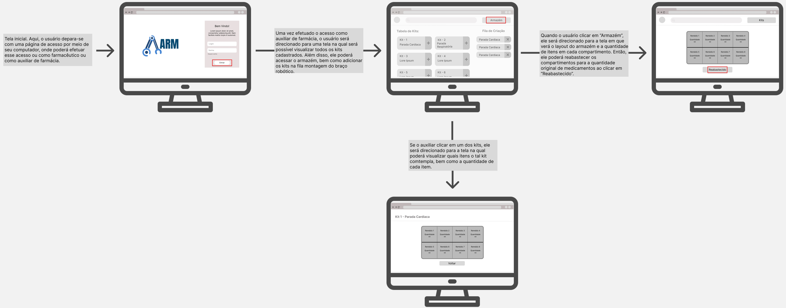

# Fluxo de Usuário (User Flow)

&emsp;O user flow, conhecido como fluxo do usuário, refere-se à sequência de passos que um usuário realiza ao interagir com um produto, serviço, aplicativo ou site com o objetivo de atingir um resultado específico. Esse mapeamento é projetado para acompanhar o percurso do usuário desde o início até a conclusão de uma tarefa ou ação desejada, visando entregar valor ao usuário [1]. Ao criar um user flow, os profissionais de UX podem identificar pontos de atrito, compreender os caminhos mais eficientes para os usuários alcançarem seus objetivos e aprimorar a experiência global do usuário. [2]

&emsp;Essa prática contribui para um design mais intuitivo, proporcionando melhor usabilidade e, por conseguinte, gerando uma experiência mais positiva para os usuários. O user flow é uma ferramenta fundamental no processo de design centrado no usuário, auxiliando na criação de produtos e interfaces alinhados às necessidades e expectativas dos usuários. [2]

&emsp;É essencial ter um entendimento claro do que o usuário (Persona) realmente necessita antes de iniciar o design, utilizando a Jornada do Usuário previamente mapeada para o projeto. O user flow serve como guia para os usuários, indicando o caminho a seguir para utilizar a solução de forma eficiente.

&emsp;Ao criar um user flow eficiente, é possível proporcionar uma experiência positiva, reduzir a frustração, aumentar a eficiência, melhorar as taxas de conversão e construir uma experiência do usuário centrada nas necessidades reais dos usuários. Essa abordagem integrada visa garantir que o design da solução esteja alinhado com as expectativas do usuário, resultando em uma interação mais harmoniosa e satisfatória. [2]

## Fluxo de Utilização da proposta

&emsp; Nosso fluxo de utilização da proposta é segmentado em duas partes principais, refletindo a estrutura da nossa interface. Isso se deve à necessidade de implementar medidas de segurança, considerando que existem dois tipos de usuários com diferentes níveis de acesso e permissões dentro da plataforma. Consequentemente, diferenciamos os fluxos de uso: um destinado ao Farmacologista e outro ao Auxiliar de Farmácia.

### Fluxo Farmacologista

&emsp; O fluxo destinado ao Farmacologista começa em uma tela principal, onde o usuário recebe um panorama completo dos modelos de kits de emergência previamente desenvolvidos. A partir dessa tela, ele pode interagir de diversas formas: acessando detalhes dos kits já criados simplesmente ao clicar sobre eles, criando novos modelos ou até mesmo excluindo os existentes.

<b> Quadro 1 - Wireframe - Tela Principal  </b> 

 

<b>Fonte: Elaborado pelos próprios autores </b> 

&emsp; Após selecionar um dos modelos de kits disponíveis na tela principal, o usuário é redirecionado para uma nova tela. Essa tela oferece uma visualização detalhada do kit escolhido, exibindo seus compartimentos e informando quais e quantos medicamentos estão contidos em cada um.

&emsp; Nesta tela, o usuário tem a opção de editar o kit ao clicar no botão localizado no canto superior direito. Alternativamente, pode retornar à tela principal utilizando o botão "voltar".

<b> Quadro 2 - Wireframe - Tela do Kit </b> 

 

<b>Fonte: Elaborado pelos próprios autores </b> 

&emsp; Ao selecionar a opção de Editar Kit, o usuário é direcionado para uma tela muito semelhante à de visualização anterior, mas com funcionalidades adicionais de edição. Nesta tela, é possível interagir com cada um dos compartimentos do kit para realizar modificações. Além disso, os botões "editar kit" e "voltar", presentes anteriormente, são substituídos por "Concluir Edição" e "Cancelar", respectivamente.

<b> Quadro 3 - Wireframe - Edição de Kit </b> 

 

<b>Fonte: Elaborado pelos próprios autores </b> 

&emsp; Portanto, ao selecionar um dos compartimentos, um modal é aberto, permitindo ao usuário alterar o medicamento contido naquele espaço, bem como ajustar a quantidade ou outras especificações necessárias. Após concluir as edições, é essencial que o usuário clique em "Atualizar" para efetivar as mudanças realizadas.

<b> Quadro 4 - Wireframe - Edição de Kit - Editando compartimento </b> 

 

<b>Fonte: Elaborado pelos próprios autores </b> 

&emsp; Retornando à tela principal, o usuário tem a opção de criar um novo modelo de kit ao pressionar o botão "Novo Kit".

<b> Quadro 5 - Wireframe - Tela Principal </b> 

 

<b>Fonte: Elaborado pelos próprios autores </b> 

&emsp; Após selecionar a opção "Novo Kit", o usuário é direcionado para uma tela bastante similar à de edição de kit, onde é possível editar todos os compartimentos e até mesmo o nome do Kit. Contudo, uma diferença chave é observada ao concluir a edição: clicar em "Concluir Edição" redireciona o usuário para a página principal, em vez de retornar à visualização do kit, como ocorre na tela de edição.

<b> Quadro 6 - Wireframe - Novo Kit </b> 

 

<b>Fonte: Elaborado pelos próprios autores </b> 

&emsp; Por fim, ao retornar à tela principal, o usuário pode excluir um modelo de kit específico ao clicar no ícone de lixeira situado ao lado do modelo em questão.

<b> Quadro 7 - Wireframe - Tela Principal </b> 

 

<b>Fonte: Elaborado pelos próprios autores </b> 

&emsp; Entretanto, antes de concluir a exclusão, é necessário confirmar essa ação por meio de um modal que se abre, oferecendo ao usuário as opções "Voltar" e "Excluir".

<b> Quadro 8 - Wireframe - Tela Principal - Excluir Kit </b> 

 

<b>Fonte: Elaborado pelos próprios autores </b> 

&emsp;Em suma, o mapeamento do fluxo de utilização do usuário farmacologista acerca da solução desenvolvida para o Hospital Sírio-Libanês pode ser representado por meio de um "wireflow". Um "wireflow" é um layout com várias telas, conectadas entre si como um fluxograma a fim de mapear os pontos de decisão e os movimentos de um cliente do início ao fim[3].

<b> Quadro 9 - Wireflow Farmacologista </b> 

 

<b>Fonte: Elaborado pelos próprios autores </b> 

&emsp;Ao acessar a solução como farmacêutica, Helena tem a possibilidade de criar um novo kit, caso haja novas necessidades no hospital. Ao finalizar a criação desse novo kit, a tela retorna ao início, e a farmacêutica pode editar este novo kit ou kits já existentes. Se a escolha for pela edição, o sistema é redirecionado a uma nova tela. Nessa tela, o farmacêutico deve selecionar a posição do kit que deseja editar e, em seguida, um pop-up surgirá na tela, onde o medicamento e a quantidade do mesmo devem ser selecionados. Ao concluir a edição, é necessário clicar no botão "Concluir edição" para então ser redirecionado à tela inicial.

&emsp;O "wireflow", como é possível visualizar na imagem acima, apresenta o fluxo de maneira ampla e de fácil assimilação. Uma vez terminada a interação com a aplicação web, o farmacologista segue, então, para a próxima fase de sua jornada. Dessa maneira, o "wireflow" cumpre o seu papel de facilitar o desenvolvimento do projeto no que concerne a "User Experience(UX)", ou, simplesmente, experiência do usuário.

---

### Fluxo Auxiliar de farmácia 

&emsp; O fluxo destinado ao Auxiliar de Farmácia, embora visualmente semelhante ao do Farmacologista, apresenta diferenças significativas logo no início. Nesta tela, o auxiliar tem a capacidade de acessar detalhes dos kits ao clicar nos modelos disponíveis. Adicionalmente, é possível adicionar kits à fila de montagem do robô ao clicar no símbolo de mais localizado ao lado de cada kit. Por último, o auxiliar pode acessar o armazém por meio de um botão dedicado.

<b> Quadro 10 - Wireframe - Tela Principal - Tela Principal </b> 

 

<b>Fonte: Elaborado pelos próprios autores </b> 

&emsp; Ao acessar um kit, o Auxiliar de Farmácia pode obter informações detalhadas sobre os medicamentos contidos nele, incluindo as quantidades de cada um. No entanto, diferentemente do Fluxo do Farmacologista, não há possibilidade de edição desses detalhes.

<b> Quadro 11 - Wireframe - Tela Principal - Tela do Kit </b> 

 

<b>Fonte: Elaborado pelos próprios autores </b> 

&emsp; Retornando à tela principal, o Auxiliar de Farmácia tem a opção de acessar o armazém ao clicar no botão designado para essa função.

<b> Quadro 12 - Wireframe - Tela Principal - Tela Principal </b> 

 

<b>Fonte: Elaborado pelos próprios autores </b> 

&emsp; Ao acessar a tela do armazém, o Auxiliar de Farmácia pode visualizar a quantidade disponível de cada medicamento armazenado. Após repor os estoques, é possível clicar em "Reabastecido" para informar o robô da atualização do estoque. Concluída essa etapa, o auxiliar pode retornar à tela principal clicando no botão "Kits".

<b> Quadro 13 - Wireframe - Tela Principal - Tela Armazem </b> 

 

<b>Fonte: Elaborado pelos próprios autores </b> 

&emsp;Similarmente ao mapeamento do fluxo de utilização do farmacologista, o fluxo de utilização do auxiliar de farmácia pode ser representado de maneira ampla e de fácil compreensão por meio do "wireflow".

<b> Quadro 14 - Wireflow Auxiliar de Farmácia </b> 

 

<b>Fonte: Elaborado pelos próprios autores </b> 

&emsp;Ao acessar a solução como Auxiliar de Farmácia, Baruc tem acesso à visualização de todos os kits necessários no hospital. Nessa primeira tela, ele pode adicionar kits à fila de montagem do braço robótico, conferir se o kit está montado corretamente e, em seguida, confirmar que o estoque está abastecido clicando em "Reabastecido", para que o robô inicie a montagem.

&emsp;Como é possível observar na imagem acima, o "wireflow" do fluxo de utilização do auxiliar de farmácia contempla as telas com que ele pode interagir, bem como o curso que segue essa interação. Dessa maneira, é possível melhor direcionar o desenvolvimento do projeto nas capacidades de UX, em especial na aplicação web, que é por onde se dará a maior parte de interação com a solução projetada para o Hospital Sírio-Libanês.

# Bibliografia:
[1] SA, G. Fluxo de usuário (User Flow): O que é? Como fazer? - 7bits - Medium. Disponível em: [https://medium.com/7bits/fluxo-de-usu%C3%A1rio-user-flow-o-que-%C3%A9-como-fazer-79d965872534](https://medium.com/7bits/fluxo-de-usu%C3%A1rio-user-flow-o-que-%C3%A9-como-fazer-79d965872534). Acesso em: 26 fev. 2024.

[2] MARCELA. User Flow: Maximizando a usabilidade do seu site ou aplicativo. Disponível em: [https://awari.com.br/user-flow/?utm_source=blog&utm_campaign=projeto+blog&utm_medium=User%20Flow:%20Maximizando%20a%20usabilidade%20do%20seu%20site%20ou%20aplicativo#:~:text=o%20User%20Flow-,O%20User%20Flow%2C%20ou%20fluxo%20do%20usu%C3%A1rio%2C%20%C3%A9%20um%20conceito,usu%C3%A1rio%20eficientes%2C%20intuitivas%20e%20agrad%C3%A1veis.](https://awari.com.br/user-flow/?utm_source=blog&utm_campaign=projeto+blog&utm_medium=User%20Flow:%20Maximizando%20a%20usabilidade%20do%20seu%20site%20ou%20aplicativo#:~:text=o%20User%20Flow-,O%20User%20Flow%2C%20ou%20fluxo%20do%20usu%C3%A1rio%2C%20%C3%A9%20um%20conceito,usu%C3%A1rio%20eficientes%2C%20intuitivas%20e%20agrad%C3%A1veis.). Acesso em: 26 fev. 2024.
‌

[3] Miro. Screen Flow UX [modelo online]. Disponível em: https://miro.com/pt/modelos/screen-flow-ux/. Acesso em: 02 mar. 2024.

