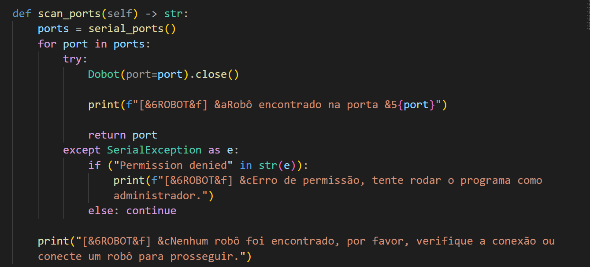
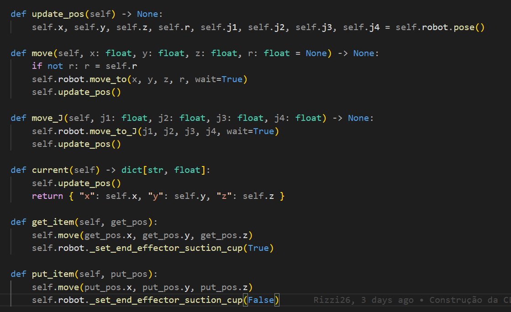
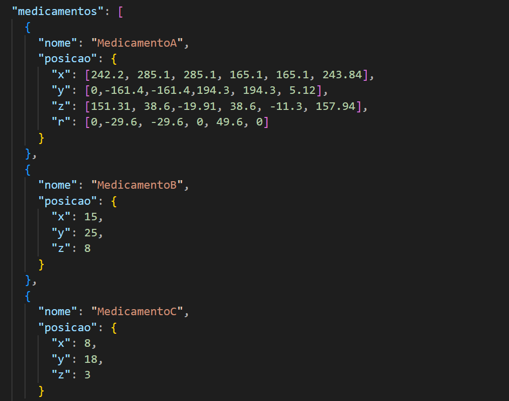

# Códigos Explicados

## Dentro da Classe "robot.py"

### 1. Importação de módulos

Figura 1 - Código de importação de módulos 

  

Fonte: Elaborado pelos próprios autores 

&emsp;Aqui, list_ports é importado para listar as portas seriais disponíveis, enquanto Fore e Style são utilizados para adicionar cores às mensagens no terminal. A classe Dobot é importada da biblioteca pydobot, proporcionando uma interface para interação com o robô. SerialException é importada para lidar com exceções relacionadas à comunicação serial, e a função serial_ports é importada para obter uma lista de portas seriais disponíveis.

### 2.  Função de Início do Robô

Figura 2 - Função de início do robô 

  

Fonte: Elaborado pelos próprios autores 

&emsp;O código faz parte do método init da classe RobotWrapper. Esse método tem como objetivo estabelecer a conexão com o robô. Ele primeiro imprime uma mensagem indicando o início do processo de conexão, após isso utiliza o método scan_ports para encontrar a porta do robô e armazena o resultado em self.port. Após isso, instancia um objeto da classe Dobot utilizando a porta encontrada e imprime uma mensagem para o usuário confirmando a conexão bem-sucedida na porta especificada. Por fim, atualiza as variáveis de posição com os valores atuais do robô através do método update_pos.

### 3.  Conexão com o robô

Figura 3 - Função de conexão com o robô 

  

Fonte: Elaborado pelos próprios autores 

&emsp;O código define o método scan_ports na classe RobotWrapper, que tem como propósito identificar a porta COM à qual o robô está conectado. Inicialmente, ele obtém uma lista de portas COM disponíveis no sistema e itera sobre essas portas. Para cada porta, tenta criar e imediatamente fechar um objeto Dobot, verificando assim a acessibilidade da porta e a presença de um robô. Se a tentativa for bem-sucedida, uma mensagem é printada para mostrar para o usuário a descoberta do robô na porta específica, e o método retorna a porta encontrada. Em caso de erros de permissão, ou se nenhum robô for encontrado, mensagens são printadas para o usuário explicando o problema.

### 4.  Movimentação do robô

Figura 4 - Função de movimentação do robô 

  

Fonte: Elaborado pelos próprios autores 

&emsp;Este conjunto de métodos na classe RobotWrapper tem como objetivo gerenciar e atualizar as posições do robô Dobot. O método update_pos é responsável por atualizar as variáveis de posição (x, y, z, r, j1, j2, j3, j4) com os valores atuais da pose do robô obtidos através do método pose da instância self.robot. Os métodos move e move_J movem o robô para coordenadas cartesianas ou articulares específicas, respectivamente. O método current retorna um dicionário contendo as coordenadas atuais do robô, utilizando a função update_pos para garantir a precisão. Os métodos get_item e put_item movem o robô para as posições especificadas para pegar ou soltar um item, ativando ou desativando o efetuador de sucção.

### 5.  Atuador

Figura 5 - Função do atuador do robô 

  

Fonte: Elaborado pelos próprios autores 

&emsp;Este conjunto de métodos adicionais na classe RobotWrapper trata do controle do efetuador de sucção do robô Dobot. Os métodos atuador_on e atuador_off são responsáveis por ativar e desativar, respectivamente, o efetuador de sucção do robô. Eles utilizam o método suck da instância self.robot, passando True para ativar o efetuador (atuador_on) e False para desativá-lo (atuador_off). 

## Dentro de "medicamentos.json"

Figura 6 - Banco de dados teste 

  

Fonte: Elaborado pelos próprios autores 

&emsp;O trecho de código apresenta um conjunto de dados estruturados em formato JSON, representando informações sobre diferentes medicamentos e suas respectivas posições no espaço tridimensional. Cada medicamento é um objeto contendo seu nome e a posição associada, expressa em termos de coordenadas cartesianas (x, y, z) e uma orientação angular (r). Por exemplo, "MedicamentoA" possui seis pontos de posição especificados por arrays para x, y, z, e r. Já "MedicamentoB" e "MedicamentoC" têm posições mais simples, definidas por valores únicos para x, y e z.

# Apresentação Sprint 2
<iframe src="https://docs.google.com/presentation/d/e/2PACX-1vT-Ei4BycCwb0nJC8bPjo1Z1CrdZS-doSt1S36iUFSC6hyv2mNjzl4PolytczdYIJxyON7L2DMOWjYa/embed?start=false&loop=false&delayms=3000" frameborder="0" width="75%" height="400" allowfullscreen="true" mozallowfullscreen="true" webkitallowfullscreen="true" style={{ display: 'block', marginLeft: 'auto', marginRight: 'auto' }} ></iframe>

<b>Fonte:</b> elaborado por Arm 
